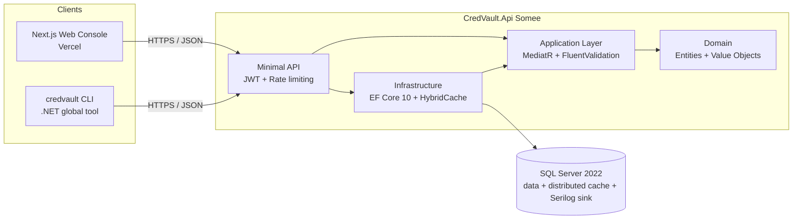

# CredVault

A team secrets manager and credential vault for engineering teams. CredVault stores connection strings, API keys, and structured credentials in dynamic, schema-defined record types, then exposes them through a CLI-first developer experience and a web console.

**Status:** repository skeleton — no business logic yet.

## Why CredVault

- **Dynamic schemas.** Define your own credential shapes (Postgres connection, AWS IAM key, generic OAuth client, etc.) instead of stuffing everything into key-value pairs.
- **CLI-first.** `credvault` ships as a .NET global tool — fetch, rotate, and inject secrets into local shells without leaving the terminal.
- **Audit-grade history.** Every read, write, rotation, and access grant is recorded.
- **Self-hostable.** Production targets Somee (backend) and Vercel (web). SQL Server is the only datastore — no Redis, no external KMS required for the skeleton.

## Architecture



Clean Architecture dependency rule: `Api -> Infrastructure -> Application -> Domain`. Domain has zero dependencies.

## Repository layout

```
backend/
  src/
    CredVault.Domain          entities, value objects, domain events, enums  (zero deps)
    CredVault.Application     CQRS handlers, DTOs, interfaces, validators
    CredVault.Infrastructure  EF Core 10, encryption, distributed cache
    CredVault.Api             Minimal API endpoints, middleware, DI
  tests/
    CredVault.Domain.Tests
    CredVault.Application.Tests
    CredVault.Infrastructure.Tests
    CredVault.Api.IntegrationTests
cli/
  src/CredVault.Cli           .NET global tool (PackAsTool=true)
  tests/CredVault.Cli.Tests
frontend/                     Next.js 14 (App Router, TS strict)
docker/
  Dockerfile.api              backend image for Somee
  Dockerfile.web              frontend image (Vercel uses its own pipeline)
docker-compose.yml            local dev: sqlserver + api + web
global.json                   pins .NET 10 SDK
Directory.Build.props         common net10.0 / nullable / warnings-as-errors
Directory.Packages.props      central NuGet versions
```

## Prerequisites

- .NET 10 SDK (10.0.100+)
- Node.js 20+ and npm
- Docker Desktop (for local SQL Server)

## Local dev quickstart

```bash
# 1) Verify SDK
dotnet --version           # expects 10.0.x

# 2) Build the backend
dotnet build backend/CredVault.slnx

# 3) Build the CLI
dotnet build cli/CredVault.Cli.slnx

# 4) Install the CLI as a global tool from a local pack
dotnet pack cli/src/CredVault.Cli -c Release -o cli/artifacts
dotnet tool install --global --add-source ./cli/artifacts CredVault.Cli
credvault --version

# 5) Run the frontend
cd frontend && npm install && npm run dev

# 6) Or bring up the whole stack
docker compose up --build
# api  → http://localhost:8080/health
# web  → http://localhost:3000
# sql  → localhost:1433 (sa / Local_Dev_Passw0rd!)
```

## Deployment

| Component | Target          | Mechanism                                                                 |
| --------- | --------------- | ------------------------------------------------------------------------- |
| Backend   | Somee           | `deploy-backend.yml` builds + pushes an image to GHCR, then hits a Somee deploy hook. Manual approval gate on the `production` environment. |
| CLI       | nuget.org       | `deploy-cli.yml` triggers on `cli-v*` tags, packs and pushes to NuGet.    |
| Frontend  | Vercel          | Native Vercel Git integration — no workflow checked in.                   |

## Roadmap

| Phase | Scope                                                                             |
| ----- | --------------------------------------------------------------------------------- |
| M0    | Repo skeleton, CI, image builds *(this commit)*                                   |
| M1    | Auth (JWT + refresh), workspaces, RBAC primitives                                  |
| M2    | Dynamic record-type schemas, encryption at rest, audit log                         |
| M3    | CLI commands — `login`, `env`, `get`, `set`, `rotate`, `run`                       |
| M4    | Web console — record browser, schema editor, audit viewer                          |
| M5    | Sharing, expiry, just-in-time access requests                                      |
| M6    | SSO (OIDC), webhooks, SCIM                                                         |

## Security note

Never commit `master-key.bin`, `appsettings.Development.json`, `secrets.json`, `~/.credvault/`, `credvault.config.local.json`, or any `.env*` file. These are explicitly listed in `.gitignore` — keep them that way.
